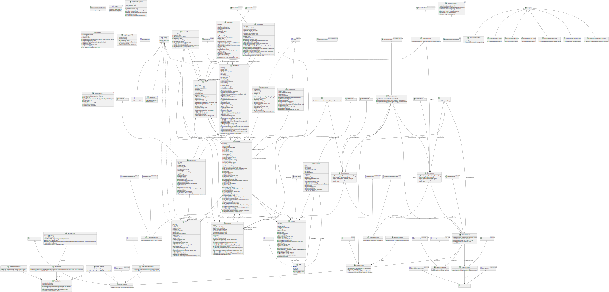

# Projeto avaliativo - Projeto Final
---

Links Úteis:

[Trello](https://trello.com/invite/b/66a50d45c21d1d8be33011ff/ATTI198d33ba5caa5a1e45150da6ceec6c1972E37690/semana-11-modulo-2-pa)
[Vídeo]()

Como executar:

1. Execute o arquivo `keys.bat` para gerar os certificados públicos e privados na pasta `resources`;
2. Executar o seguinte comando: `mvn spring-boot:run`
